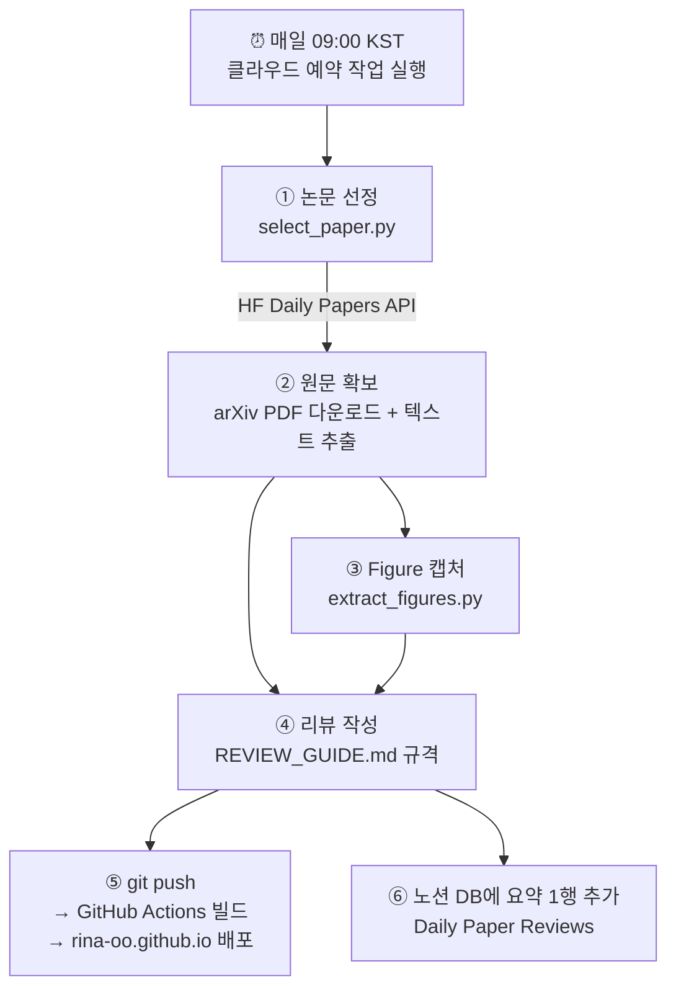

# 📰 Daily Paper Review 파이프라인 — 동작 원리

매일 오전 9시(KST), 사람 손 없이 "논문 선정 → 원문 읽기 → 리뷰 작성 → 블로그 발행 → 노션 기록"이 한 번에 돌아간다. 이 문서는 각 단계가 **정확히 어떻게** 동작하는지 설명한다.

## 전체 흐름 한눈에 보기



---

## ① 논문 선정 — HuggingFace를 어떻게 불러오나

**핵심: 크롤링이 아니라 공식 JSON API를 쓴다.** ([scripts/select_paper.py](../scripts/select_paper.py))

```
GET https://huggingface.co/api/daily_papers?date=2026-07-28
```

이 API는 해당 날짜의 daily papers 목록을 JSON으로 돌려준다. 각 항목에서 쓰는 필드:

| 필드 | 내용 | 용도 |
|---|---|---|
| `paper.id` | arXiv ID (예: `2607.24653`) | 논문 식별·중복 체크의 키 |
| `paper.title` | 제목 | 리뷰 제목 |
| `paper.upvotes` | 추천 수 | **정렬 기준** (내림차순 1위 선택) |
| `paper.summary` | 초록 | 리뷰 시작점 (이것만으로 쓰지는 않음) |
| `paper.githubRepo` | 공식 저장소 | 출처 링크 |

선정 로직은 3개의 규칙으로 되어 있다:

1. **날짜**: KST 기준 **어제** 날짜로 조회한다. (HF는 UTC 기준으로 매일 갱신되므로, 한국 아침에는 "어제" 목록이 확정된 상태다)
2. **주말/공휴일 처리**: 어제 날짜에 논문이 없으면(주말엔 발행 안 됨) 하루씩 거슬러 올라가며 **최대 5일**까지 탐색한다.
3. **중복 방지**: `_posts/` 폴더의 파일명에 arXiv ID가 박혀 있다(`2026-07-29-2607.24653.md`). 파일명을 정규식으로 스캔해 "이미 리뷰한 ID 집합"을 만들고, upvote 1위가 그 집합에 있으면 **2위, 3위…로 내려간다**. 별도 DB 없이 폴더 자체가 리뷰 이력이다.

출력은 JSON 한 덩어리다:

```json
{
  "arxiv_id": "2607.24653",
  "title": "Kimi K3: Open Frontier Intelligence",
  "upvotes": 289,
  "arxiv_url": "https://arxiv.org/abs/2607.24653",
  "ar5iv_url": "https://ar5iv.labs.arxiv.org/html/2607.24653",
  "hf_url": "https://huggingface.co/papers/2607.24653"
}
```

> 확장 포인트: PyTorch 한국 사용자 모임(discuss.pytorch.kr)을 2차 소스로 붙일 때는 `fetch_hf_daily()`와 같은 형태의 fetch 함수를 하나 더 만들어 등록하면 된다.

---

## ② 원문 확보 — arXiv에서 어떻게 읽나

**abstract만 보고 리뷰를 쓰지 않는 것**이 원칙이라 논문 전문이 필요하다. 우선순위가 있다:

| 순위 | 방법 | 왜 |
|---|---|---|
| 1 | `arxiv.org/html/<id>v1` 또는 ar5iv HTML | 구조화된 HTML이라 읽기 가장 좋음 |
| 2 | **PDF 다운로드 + 텍스트 추출** | 최신 논문은 HTML 변환이 아직 없는 경우가 많음 (Kimi K3가 그랬음) |

PDF 경로일 때의 실제 처리:

```bash
# 1. PDF 다운로드
curl -sL -o paper.pdf "https://arxiv.org/pdf/2607.24653"

# 2. Docker 컨테이너 안에서 pypdf로 전체 텍스트 추출
docker compose exec scripts python -c "
from pypdf import PdfReader
r = PdfReader('paper.pdf')
text = '\n'.join(p.extract_text() for p in r.pages)  # 47페이지 → 18만 자
"
```

추출된 텍스트는 레이아웃(2단 조판 등)이 다소 깨지지만, **수식·표·본문 내용을 파악하는 데는 충분**하다. 이 텍스트를 섹션별로 읽으면서 아키텍처 수식, 실험 수치, 한계 서술을 원문에서 직접 확인하고 리뷰에 옮긴다. 논문에 없는 수치를 만들지 않는 것이 규칙이라, 모든 벤치마크 숫자는 이 추출 텍스트와 대조된다.

---

## ③ Figure 처리 — 그림을 어떻게 캡처하나

PDF의 그림은 대부분 벡터 그래픽이라 "이미지 파일 추출"이 안 된다. 그래서 **페이지에서 그림 영역을 찾아 고해상도로 렌더링(스크린샷)**한다. ([scripts/extract_figures.py](../scripts/extract_figures.py), PyMuPDF 사용)

동작 원리:

```
1. 캡션 찾기     : 전체 페이지에서 "Figure 7:" 텍스트의 좌표를 검색
2. 그림 영역 추정 : 캡션 위쪽에 있는 벡터 드로잉·이미지 블록들의
                   bounding box를 전부 합집합(union)
3. 라벨 포함     : 축 라벨·범례 같은 그림 내부 텍스트 블록도 영역에 편입
4. 가로 폭 고정  : 캡션은 본문 전체 폭이므로 좌우를 페이지 본문 폭으로 확장 (잘림 방지)
5. 렌더링       : 그 영역만 2.5배 확대로 PNG 렌더링 → assets/img/posts/<arxiv_id>/figureN.png
```

사용법:

```bash
docker compose exec scripts python scripts/extract_figures.py /tmp/paper.pdf assets/img/posts/2607.24653 1 2 3 7 13
```

캡처 후에는 **이미지를 직접 열어 확인**한다 — Kimi K3 때는 Figure 1이 표지 전체로 잡혀서 그림 부분만 crop하고, arXiv 워터마크를 잘라내는 후처리를 했다. 이렇게 확인·보정된 이미지가 포스트에 들어간다.

**규칙 (REVIEW_GUIDE.md):** 캡처만 붙이고 지나가면 안 된다. 모든 그림 아래에 "이 그림이 무엇을 보여주고 왜 중요한가"를 설명하는 해석 문단이 반드시 따라붙는다. 최소 포함 대상은 아키텍처 개요도와 핵심 결과 그래프.

---

## ④ Table 처리 — 표를 어떻게 옮기나

표는 이미지 캡처가 아니라 **마크다운 표로 전체 재현**한다.

- ②에서 추출한 PDF 텍스트에 표의 셀 값들이 순서대로 들어 있다. 이를 논문 PDF 원본과 대조하면서 마크다운 표로 재조립한다.
- **행을 추리거나 요약하지 않는다.** Kimi K3 리뷰의 Table 2는 44개 벤치마크 행이 전부 들어갔다.
- 논문의 서식도 따라간다: **볼드 = 1위**, _이탤릭 = 2위_ (원문의 밑줄 표기 대체), `a / b` = 도구 미사용/사용 점수.
- 표 아래에는 항상 해석 문단을 붙인다 (숫자가 무엇을 의미하는지).

이미지가 아닌 텍스트 표라서 블로그에서 검색되고, 모바일에서도 스크롤로 읽을 수 있다.

---

## ⑤ 발행 — 블로그에 어떻게 올라가나

```
_posts/2026-07-29-2607.24653.md 작성
        │ git push (main)
        ▼
GitHub Actions "Build and Deploy" 워크플로 자동 실행
        │ Jekyll(Chirpy 테마) 빌드 — 마크다운 → HTML, 수식은 MathJax
        ▼
GitHub Pages 배포 → https://rina-oo.github.io/posts/2607.24653/
```

- 포스트 상단의 front matter(제목, 날짜, 카테고리, `math: true` 등)가 Chirpy 테마의 목차·태그·수식 렌더링을 제어한다.
- push만 하면 나머지는 GitHub이 알아서 한다. 보통 push 후 1분 내 반영.
- 발행 URL 규칙: `https://rina-oo.github.io/posts/<arxiv_id>/`

## ⑥ 노션 기록 — 아카이브는 어떻게 쌓이나

발행이 끝나면 노션 **Home > Daily Paper Reviews** 데이터베이스에 한 줄이 추가된다. 블로그가 "전문"이라면 노션은 "한눈에 훑는 카탈로그"다.

| 속성 | 내용 |
|---|---|
| Title / Date / arXiv / Upvotes / Source | 논문 기본 정보 |
| Category | LLM, MoE, Vision, RL … 태그 (복수 선택) |
| 요약 | 2~3문장 핵심 |
| 흐름 | 논문 전개를 화살표로 한 줄 정리 |
| Contribution | 핵심 기여 ①②③ |
| Limitation | 한계 요약 |
| Blog Link | 블로그 전문 리뷰 링크 |

---

## ⏰ 자동화 — 매일 누가 실행하나

**Claude Code 클라우드 예약 작업(routine)**이 실행 주체다. 내 컴퓨터가 꺼져 있어도 돌아간다.

- 스케줄: 매일 00:00 UTC = **09:00 KST**
- 실행 내용: 클라우드에서 이 저장소를 체크아웃 → 위 ①~⑥ 단계를 순서대로 수행. 리뷰 규격은 저장소의 `REVIEW_GUIDE.md`를 읽어 따른다.
- 안전장치: 오늘 날짜 포스트가 이미 있으면 아무것도 하지 않고 종료 (중복 발행 방지)
- 관리: <https://claude.ai/code/routines> (일시정지·수동실행·프롬프트 수정 가능)

## 🔧 수동으로 돌려보고 싶을 때

```bash
cd ~/Projects/rina-oo.github.io
docker compose up -d                                  # 컨테이너 시작
docker compose exec scripts python scripts/select_paper.py   # 오늘의 논문 선정
docker compose up -d jekyll                           # http://localhost:4000 미리보기
```

## 📁 파일 맵

| 파일 | 역할 |
|---|---|
| `scripts/select_paper.py` | 논문 선정 (HF API + 주말 소급 + 중복 방지) |
| `scripts/extract_figures.py` | PDF에서 Figure 캡처 |
| `REVIEW_GUIDE.md` | **리뷰 형식의 단일 기준** — 형식을 바꾸려면 이 파일만 수정 |
| `_posts/` | 리뷰 원고 (파일명 = 발행일 + arXiv ID = 리뷰 이력) |
| `assets/img/posts/<arxiv_id>/` | 캡처된 Figure 이미지 |
| `Dockerfile`, `docker-compose.yml` | 로컬 실행 환경 (jekyll 미리보기 + scripts) |
| `docs/PIPELINE.md` | 이 문서 |
