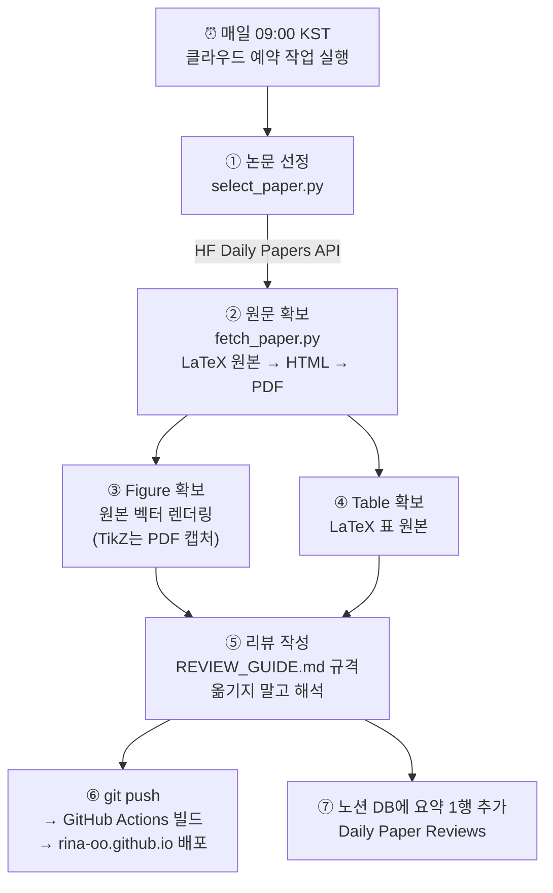

# 📰 Daily Paper Review 파이프라인 — 동작 원리

매일 오전 9시(KST), 사람 손 없이 "논문 선정 → 원문 읽기 → 리뷰 작성 → 블로그 발행 → 노션 기록"이 한 번에 돌아간다. 이 문서는 각 단계가 **정확히 어떻게** 동작하는지 설명한다.

## 전체 흐름 한눈에 보기



---

## ① 논문 선정 — HuggingFace를 어떻게 불러오나

**핵심: 크롤링이 아니라 공식 JSON API를 쓴다.** ([scripts/select_paper.py](../scripts/select_paper.py))

```
GET https://huggingface.co/api/daily_papers?date=2026-07-28
```

이 API는 해당 날짜의 daily papers 목록을 JSON으로 돌려준다. 각 항목에서 쓰는 필드:

| 필드 | 내용 | 용도 |
|---|---|---|
| `paper.id` | arXiv ID (예: `2607.24653`) | 논문 식별·중복 체크의 키 |
| `paper.title` | 제목 | 리뷰 제목 |
| `paper.upvotes` | 추천 수 | **정렬 기준** (내림차순 1위 선택) |
| `paper.summary` | 초록 | 리뷰 시작점 (이것만으로 쓰지는 않음) |
| `paper.githubRepo` | 공식 저장소 | 출처 링크 |

선정 로직은 3개의 규칙으로 되어 있다:

1. **날짜**: KST 기준 **어제** 날짜로 조회한다. (HF는 UTC 기준으로 매일 갱신되므로, 한국 아침에는 "어제" 목록이 확정된 상태다)
2. **주말/공휴일 처리**: 어제 날짜에 논문이 없으면(주말엔 발행 안 됨) 하루씩 거슬러 올라가며 **최대 5일**까지 탐색한다.
3. **중복 방지**: `_posts/` 폴더의 파일명에 arXiv ID가 박혀 있다(`2026-07-29-2607.24653.md`). 파일명을 정규식으로 스캔해 "이미 리뷰한 ID 집합"을 만들고, upvote 1위가 그 집합에 있으면 **2위, 3위…로 내려간다**. 별도 DB 없이 폴더 자체가 리뷰 이력이다.

출력은 JSON 한 덩어리다:

```json
{
  "arxiv_id": "2607.24653",
  "title": "Kimi K3: Open Frontier Intelligence",
  "upvotes": 289,
  "arxiv_url": "https://arxiv.org/abs/2607.24653",
  "ar5iv_url": "https://ar5iv.labs.arxiv.org/html/2607.24653",
  "hf_url": "https://huggingface.co/papers/2607.24653"
}
```

> 확장 포인트: PyTorch 한국 사용자 모임(discuss.pytorch.kr)을 2차 소스로 붙일 때는 `fetch_hf_daily()`와 같은 형태의 fetch 함수를 하나 더 만들어 등록하면 된다.

---

## ② 원문 확보 — arXiv에서 어떻게 읽나

**abstract만 보고 리뷰를 쓰지 않는 것**이 원칙이라 논문 전문이 필요하다. [scripts/fetch_paper.py](../scripts/fetch_paper.py)가 3단계로 폴백하며 **가장 손실이 적은 소스**를 자동으로 고른다.

```bash
python3 scripts/fetch_paper.py 2607.24653 --out /tmp/paper
```

| tier | 소스 | 수식 | 표 | 그림 |
|---|---|---|---|---|
| 1️⃣ `latex-source` | arXiv **`/e-print/`** (LaTeX 원본) | 원본 LaTeX 그대로 | `\textbf`/`\uline` 서식 보존 | 저자 원본 벡터 파일 |
| 2️⃣ `arxiv-html` | arXiv `/html/` (LaTeXML 변환) | MathML + TeX annotation | HTML 표 | `` |
| 3️⃣ `pdf-fallback` | PDF 텍스트 + 페이지 이미지 | ⚠️ 깨짐 | 눈으로 재구성 | 좌표 추정 캡처 |

### 왜 LaTeX 원본이 결정적인가

PDF 파싱 도구들(pypdf, Marker, MinerU, Docling…)은 전부 **조판된 결과물에서 원본을 역추정하려는** 시도다. 그런데 arXiv는 저자가 제출한 **LaTeX 소스 자체**를 `/e-print/`로 공개한다. 역추정할 필요 없이 원본을 그냥 받으면 된다.

같은 수식을 두 경로로 뽑으면 차이가 분명하다.

```
❌ pypdf 추출 (레이아웃 붕괴)
   St =  I−β tktk⊤ t  Diag(αt)St−1 +β tktv⊤ t , ˜ot =S ⊤ t qt.(1)

✅ LaTeX 원본 (MathJax에 그대로 붙여넣기 가능)
   \mathbf{S}_t = \left(\mathbf{I}-\beta_t\bm{k}_t\bm{k}_t^{\top}\right)
                  \operatorname{Diag}(\bm{\alpha}_t)\mathbf{S}_{t-1}
                  + \beta_t\bm{k}_t\bm{v}_t^{\top}
```

표도 마찬가지다. PDF에서는 어느 숫자가 1위인지 눈으로 추론해야 하지만, LaTeX 원본에는 `\textbf{59.9}`, `\uline{58.9}`처럼 **저자가 매긴 순위 표시가 그대로** 들어 있다.

스크립트가 하는 일:
1. `/e-print/` tarball을 받아 압축 해제
2. `\documentclass`가 있는 루트 `.tex`를 찾고 `\input`/`\include`를 재귀적으로 펼쳐 본문을 하나로 합침
3. `\newcommand` 매크로를 수집해 캡션에 적용 (`\kimi{3}` → `Kimi K3`)
4. `figure`/`table` 환경을 파싱해 캡션·라벨·그래픽 경로를 `manifest.json`으로 정리

> tier가 `pdf-fallback`이면 수식 텍스트를 믿지 말고 `/tmp/paper/pages/*.png` 페이지 이미지를 **직접 눈으로 보고** 확인한다.

---

## ③ Figure 처리 — 그림을 어떻게 얻나

두 경로가 있고 앞쪽이 훨씬 깨끗하다.

**(a) 저자 원본 파일 렌더링 (기본)** — LaTeX 소스의 `\includegraphics{figures/scaling-law.pdf}`가 가리키는 **원본 벡터 PDF를 3배 해상도로 래스터화**한다. 페이지 배경도 arXiv 워터마크도 없고, 원문 캡션이 이미지에 박혀 있지 않아 한국어 캡션을 따로 붙일 수 있다. 서브플롯이 개별 파일이면 개별 이미지로 분리된다.

**(b) 발행 PDF에서 캡처 (폴백)** — TikZ/pgfplots로 그린 그림은 외부 파일이 없다(Kimi K3의 아키텍처 도식이 이 경우). 이때만 [extract_figures.py](../scripts/extract_figures.py)가 자동 호출된다:

```
1. 캡션 찾기     : "Figure 7:" 텍스트의 좌표를 검색
2. 그림 영역 추정 : 캡션 위쪽 벡터 드로잉·이미지 블록의 bounding box 합집합
3. 라벨 포함     : 축 라벨·범례 등 그림 내부 텍스트 블록 편입
4. 가로 폭 고정  : 본문 폭으로 확장 (잘림 방지)
5. 렌더링       : 2.5배 확대 PNG
```

어느 경로든 **이미지를 직접 열어 확인**한 뒤 글에 넣는다.

**규칙 (REVIEW_GUIDE.md):** 그림은 붙이는 게 아니라 **읽어주는** 것이다. 모든 그림 아래에 축이 무엇이고 어디를 봐야 하며 그래서 무슨 뜻인지 설명하는 문단이 반드시 따라붙는다. 캡션만 보고 쓰지 않는다. 그리고 전부 넣지 않고 논지에 필요한 3~5개만 고른다.

---

## ④ Table 처리 — 표를 어떻게 옮기나

표는 이미지 캡처가 아니라 **마크다운 표로 전체 재현**한다. 텍스트라서 블로그에서 검색되고 모바일에서도 읽힌다.

- `manifest.json`의 `tables[].latex`에 **LaTeX 표 원본이 통째로** 들어 있다. 여기서 마크다운으로 옮긴다.
- **행을 추리거나 요약하지 않는다.** Kimi K3 리뷰의 Table 2는 44개 벤치마크 행이 전부 들어갔다.
- 서식 마커를 그대로 따라간다 — 이건 추론이 아니라 원본에 명시된 정보다:
  - `\textbf{}` → **볼드** (저자가 표시한 1위)
  - `\uline{}` → _이탤릭_ (2위, 마크다운에 밑줄이 없어 대체)
  - `\multicolumn{}`으로 묶인 그룹 헤더 → 표 안의 구분 행
- 표 아래에는 항상 해석 문단을 붙인다. 숫자를 나열하지 말고 **패턴**을 짚는다.

---

## ⑤ 리뷰 작성 — 어떤 글로 쓰나

수식·그림·표를 다 모았다고 리뷰가 되는 건 아니다. `REVIEW_GUIDE.md`가 정하는 원칙은 하나로 요약된다: **옮기지 말고 해석한다.**

- **수식**: 전부 넣지 않고 핵심 3~5개만. 넣은 수식은 `도입 문장 → 수식 → 기호 설명 → 의미 해석` 4단 구성. 4단(의미 해석)이 없으면 그 수식은 빼는 게 낫다.
- **그림**: 축이 뭔지, 어디를 봐야 하는지, 그래서 무슨 뜻인지를 쓴다.
- **표**: 숫자 나열이 아니라 패턴을 짚는다.

문체는 **존댓말**이다. 한국 논문 리뷰 블로그 8곳(kimjy99, hoya012, 갈아먹는 머신러닝, gaussian37, kyujinpy, 위클리 NLP 등)을 조사한 결과, 읽는 맛이 있는 글은 대부분 존댓말이었고 평서체는 정확하지만 논문 번역문처럼 읽혔다. 그 외 조사에서 나온 공통 습관:

- 전문 용어는 **영어 그대로** (8곳 모두 그랬다) — `fine-tuning`을 "미세조정"으로 억지 번역하지 않는다
- 논문 주장은 "~라고 합니다", 검증된 사실은 "~입니다"로 **말투를 구분**
- 논문 밖 맥락을 곁들인다 (당시 하드웨어 사정, 인용 수, 후속 연구)
- 모르는 건 모른다고 쓴다 — "논문에 명시되어 있지 않네요"
- 개인 의견은 "개인적으로는", "여담으로" 같은 마커로 논문 내용과 구분

---

## ⑥ 발행 — 블로그에 어떻게 올라가나

```
_posts/2026-07-29-2607.24653.md 작성
        │ git push (main)
        ▼
GitHub Actions "Build and Deploy" 워크플로 자동 실행
        │ Jekyll(Chirpy 테마) 빌드 — 마크다운 → HTML, 수식은 MathJax
        ▼
GitHub Pages 배포 → https://rina-oo.github.io/posts/2607.24653/
```

- 포스트 상단의 front matter(제목, 날짜, 카테고리, `math: true` 등)가 Chirpy 테마의 목차·태그·수식 렌더링을 제어한다.
- push만 하면 나머지는 GitHub이 알아서 한다. 보통 push 후 1분 내 반영.
- 발행 URL 규칙: `https://rina-oo.github.io/posts/<arxiv_id>/`

## ⑦ 노션 기록 — 아카이브는 어떻게 쌓이나

발행이 끝나면 노션 **Home > Daily Paper Reviews** 데이터베이스에 한 줄이 추가된다. 블로그가 "전문"이라면 노션은 "한눈에 훑는 카탈로그"다.

| 속성 | 내용 |
|---|---|
| Title / Date / arXiv / Upvotes / Source | 논문 기본 정보 |
| Category | LLM, MoE, Vision, RL … 태그 (복수 선택) |
| 요약 | 2~3문장 핵심 |
| 흐름 | 논문 전개를 화살표로 한 줄 정리 |
| Contribution | 핵심 기여 ①②③ |
| Limitation | 한계 요약 |
| Blog Link | 블로그 전문 리뷰 링크 |

---

## ⏰ 자동화 — 매일 누가 실행하나

**Claude Code 클라우드 예약 작업(routine)**이 실행 주체다. 내 컴퓨터가 꺼져 있어도 돌아간다.

- 스케줄: 매일 00:00 UTC = **09:00 KST**
- 실행 내용: 클라우드에서 이 저장소를 체크아웃 → 위 ①~⑦ 단계를 순서대로 수행. 리뷰 규격은 저장소의 `REVIEW_GUIDE.md`를 읽어 따른다.
- 안전장치: 오늘 날짜 포스트가 이미 있으면 아무것도 하지 않고 종료 (중복 발행 방지)
- 관리: <https://claude.ai/code/routines> (일시정지·수동실행·프롬프트 수정 가능)

## 🔧 수동으로 돌려보고 싶을 때

```bash
cd ~/Projects/rina-oo.github.io
docker compose up -d                                  # 컨테이너 시작
docker compose exec scripts python scripts/select_paper.py   # 오늘의 논문 선정
docker compose exec scripts python scripts/fetch_paper.py 2607.24653 --out /tmp/paper  # 원문 확보
docker compose up -d jekyll                           # http://localhost:4000 미리보기
```

## 📁 파일 맵

| 파일 | 역할 |
|---|---|
| `scripts/select_paper.py` | 논문 선정 (HF API + 주말 소급 + 중복 방지) |
| `scripts/fetch_paper.py` | **원문 확보 (LaTeX 원본 → HTML → PDF 폴백) + 그림/표 파싱** |
| `scripts/extract_figures.py` | PDF에서 Figure 캡처 (TikZ 그림용 폴백) |
| `REVIEW_GUIDE.md` | **리뷰 형식의 단일 기준** — 형식을 바꾸려면 이 파일만 수정 |
| `_posts/` | 리뷰 원고 (파일명 = 발행일 + arXiv ID = 리뷰 이력) |
| `assets/img/posts/<arxiv_id>/` | 캡처된 Figure 이미지 |
| `Dockerfile`, `docker-compose.yml` | 로컬 실행 환경 (jekyll 미리보기 + scripts) |
| `docs/PIPELINE.md` | 이 문서 |
